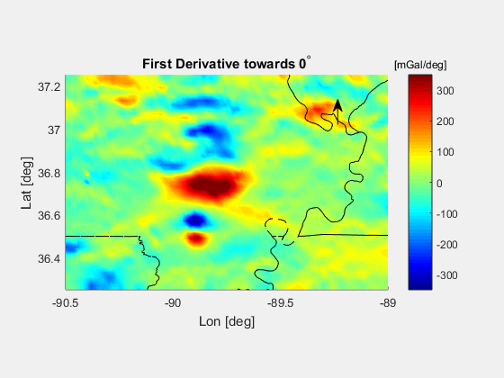

**Regional Geop. Synthesis Group Project** <br>
    - *a redistribution of `plot_cen_maggrav` and `profile_cen_maggrav`*

**Abstract**
> The project aims to reproduce the functionalities of `plot_cen_maggrav` and
> `profile_cen_maggrav` on a modern platform, instead of via the original shell
> scripts, which makes the programs easier to read and debug/modify.

**Features and capabilities**
1) Plot several EW and NS cross-section profiles
2) Detrending of the raw data before doing upward/downward continuations
   - Read GMT scripts under the `./report/` folder for details
3) Locations of the cross-section planes are determined automatically according
   to your input data
   - No adjustment is needed for a different study region
4) Compute directional derivative towards arbitrary azimuth and create a
   0~359 deg animation
5) Compute the maximum magnitude of first derivative towards each direction
   and plot it as a function of azimuth

All tests passed on OS X 10.6.8 and 10.9.5 with GMT 4 installed.


-------------------------------------------------------------
 Plot cross-section profiles of the raw data
-------------------------------------------------------------

1. Use `main` to plot several EW and NS cross-section profiles and calculate
    first and second derivatives.
   - Prepare
     ```
     ./input/xyzgrd.asc  // raw, three-column data
                         // does not have to be gridded
     ```
   - Run `./main.m` in MATLAB
   - Output:
     ```
     ./input/first_*.xyv
     ./input/second_*.xyv
     ./output/raw_data/profiles_ew.png
     ./output/raw_data/profiles_ns.png
     ./output/raw_data/xy_plane.png
     ```

2. Take down the range of longitude and latitude printed in the Command Window.

3. Show cross-section profiles of the derivatives
   - Read documentations of `cross_profiles()` and the examples in `main.m`
       closely.

* Determination of projection thickness
  - Each plane must have a projection thickness (given by the tolerance of data
    truncation), which means you could have multiple profiles for a single
    cross-section.
  - If multiple profiles exist within a projection range, then mean values will
    be computed.
  - If the tolerance is overly small, you may have problems with data
    truncation.
  - It is suggested that you start from a small truncation tolerance (e.g. half
    of the global spacing) and increase it little by little, until the message
    `No data obtained for projection!` is gone.
  - Previous output will be cleaned up whenever the error message is prompted
    out. This is to avoid any confusion that is possible e.g. people trying to
    interpret old and outdated figures.


-------------------------------------------------------------
 Compute downward/upward continuations
-------------------------------------------------------------

1. Go to `./report/`

2. Edit each `*.gmt` script. Modify the study region according to your MATLAB
    screen output. This must be done manually.

3. Go back to the root working directory.

4. Use `plot_all` to drive all the GMT scripts in the `./report/` directory.
   - Run `./plot_all.sh`
   - Output:
     ```
     ./report/downward_*.png
     ./report/downward_*.ps
     ./report/upward_*.png
     ./report/upward_*.ps
     ```

* Programming notes
  - You have to take care of the contour interval and color scale tickmarks
      according to the range of your data to optimize the plots. GMT will not
      adjust them for you.


-------------------------------------------------------------
 Additional feature
-------------------------------------------------------------

* Compute first derivatives toward each direction and create an animation.
    Record the maximum magnitude in the derivatives and plot them as a function
    of azimuth.
  - To make the animation strictly periodic, please set up an integer divisor
      of 360.


**Example Output**
  - Animated first derivatives toward each direction (looping around a full
      circle), created with a stepsize of 6 deg.
    
  - Maximum amplitudes of derivatives as a function of azimuth, created using a
      stepsize of 15 deg.
    
