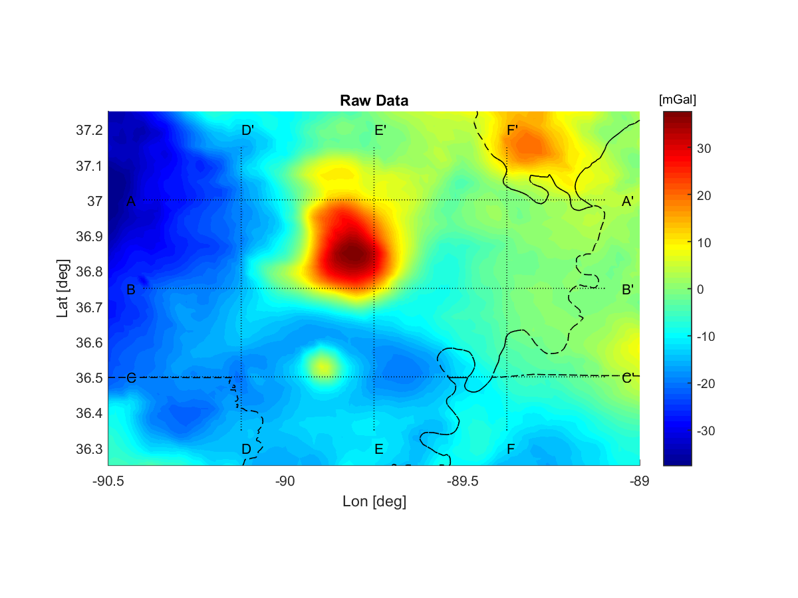
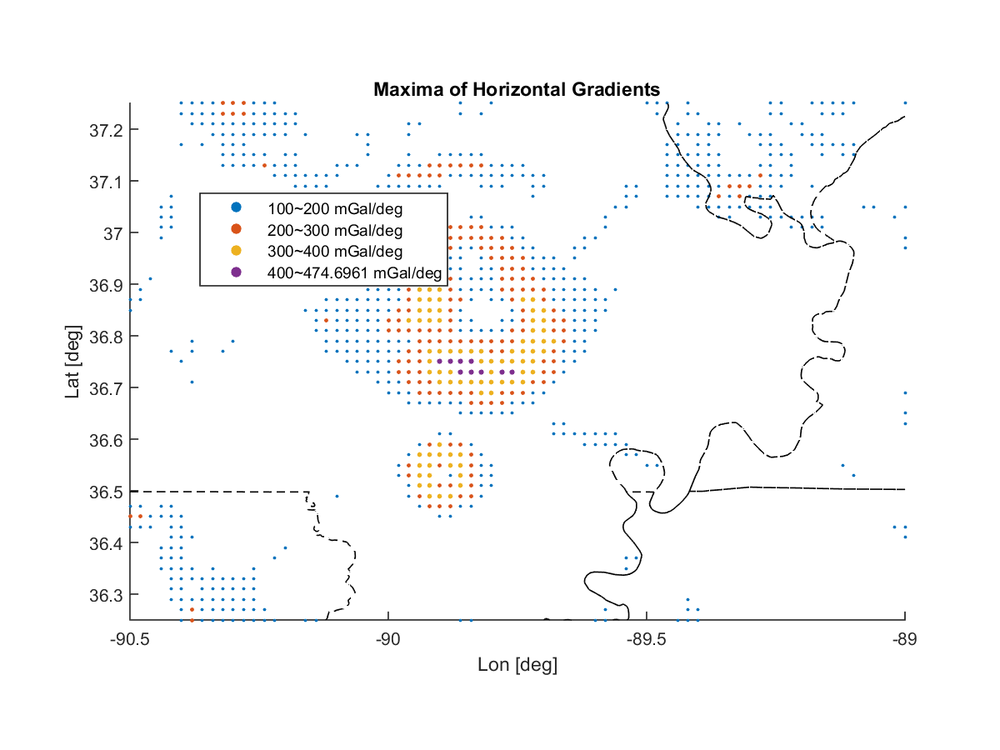
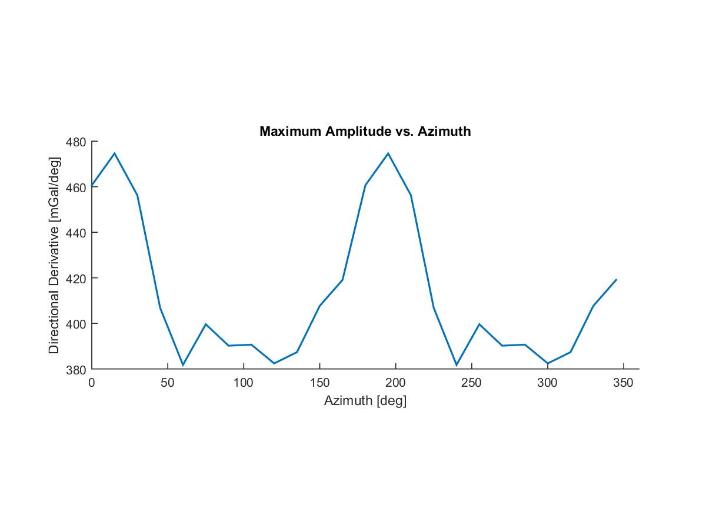

**Regional Geop. Synthesis Individual Project** <br>
    - *a redistribution of `plot_cen_maggrav` and `profile_cen_maggrav`*

**Abstract**
> The project aims to reproduce the functionalities of `plot_cen_maggrav` and
> `profile_cen_maggrav` on a modern platform, instead of via the traditional
> shell scripts, which makes the programs easier to read and debug/modify.

**Features and capabilities**
1) Show places where magnitudes of horizontal gradients are locally high
2) Plot several EW and NS cross-section profiles
3) Detrending of the raw data before doing upward/downward continuations
   - Read GMT scripts under the `./report/` folder for details
4) A lot of parameters are taken care of by the program automatically
   - No adjustment is needed for a different study region
5) Compute directional derivative towards arbitrary azimuth and create a
   0~359 deg animation
6) Record the maximum magnitudes of directional derivatives and plot them as a
   function of azimuth

**Last update**
* Added state boundaries - wraps the functionalities of GSHHG dataset

All tests passed on OS X 10.6.8 and 10.9.5 with GMT 4 installed.


-----------------------------------------------------------------------------
 Horizontal gradients, cross-section profiles and derivatives
-----------------------------------------------------------------------------

1. Use `main` to show places where magnitudes of horizontal gradients are
    locally high, plot several EW and NS cross-section profiles and calculate
    first and second derivatives.
   - Prepare
     ```
     ./input/xyzgrd.asc  // raw, three-column data
                         // does not have to be gridded
     ```
   - Run `./main.m` in MATLAB
   - Output:
     ```
     ./input/first_*.xyv
     ./input/second_*.xyv
     ./output/raw_data/dot_plot.png
     ./output/raw_data/profiles_ew.png
     ./output/raw_data/profiles_ns.png
     ./output/raw_data/xy_plane.png
     ```

2. Take down the range of longitude and latitude printed in the Command Window.

3. Show cross-section profiles of the derivatives
   - Read documentations of `cross_profiles()` and the examples in `main.m`
       closely.

* Miscellanies about `borders v2`
  - `borders v2` is a light alternative to the prominent Mapping Toolbox that
      comes with MATLAB R2015+. It works on all the MATLAB versions even if you
      do not have the Mapping Toolbox. An obvious advantage of `borders v2`
      over the GSHHG dataset is its file size.
  - To plot a different region not in the U.S., change `'continental us'` to
      `'countries'`.
  - Specify `'nomap'` to use pure number tickmarks, for example, -90 represents
      90 W and 90 represents 90 E - important if you want to superimpose the
      coastlines onto an existing dataset, such as gravity map.
  - Specify `'HandleVisibility','off'` to hide the handles from the legend - you
      will have many useless labels otherwise.
  - See
    ```
    https://www.mathworks.com/examples/matlab/community/20106-borders-documentation
    ```
    for documents.


-----------------------------------------------------------------------------
 Compute downward/upward continuations
-----------------------------------------------------------------------------

1. Go to `./report/`

2. Edit each `*.gmt` script. Modify the study region according to your MATLAB
    screen output. This must be done manually.

3. Go back to the root working directory.

4. Use `plot_all` to drive all the GMT scripts in the `./report/` directory.
   - Run `./plot_all.sh`
   - Output:
     ```
     ./report/downward_*.png
     ./report/downward_*.ps
     ./report/upward_*.png
     ./report/upward_*.ps
     ```

* Programming notes
  - You have to take care of the contour interval and color scale tickmarks
      according to the range of your data to optimize the plots. GMT will not
      adjust them for you.


-----------------------------------------------------------------------------
 Additional feature
-----------------------------------------------------------------------------

* Compute first derivatives toward each direction and create an animation.
    Record the maximum magnitude in the derivatives and plot them as a function
    of azimuth.
  - To make the animation strictly periodic, please set up an integer divisor
      of 360 for the stepsize.


**Example Output**
  - Original gravity map with state boundaries. <br>
    
  - Places where magnitudes of horizontal gradients are locally higher than
      their surrounding regions. <br>
    
  - Animated first derivatives toward each direction (looping around a full
      circle), created with a stepsize of 6 deg. <br>
    
  - Maximum amplitudes of derivatives as a function of azimuth, created using a
      stepsize of 15 deg. <br>
    
