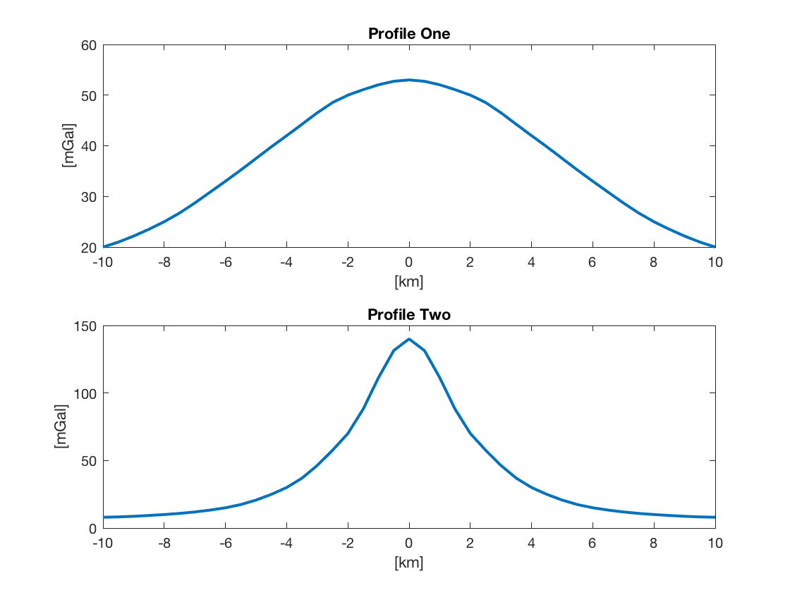
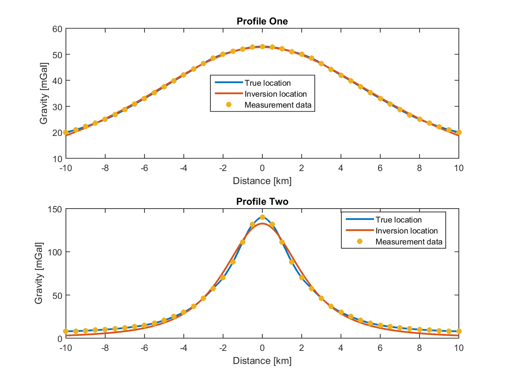

**Yu Geng's gravity forward and inverse modeling program** <br>
    - *based upon Shu-Chioung Chiu's `prob2.m`* <br>

**Abstract**
> The project aims to combine Chuck's `grav2d.m` program (for forward modeling)
> and Shu-Chioung's `prob2.m` program (for inverse modeling) in a single
> package and provide detailed, easier-to-understand documentations.
> The `grav2d.m` program does not work on most MATLAB versions. We took
> Elizabeth's screenshots, digitize them and used the data as the inputs for
> inverse modeling.

**New features added**
1) Read Elizabeth's gravity profiles (output from `grav2d`) as the input data
2) Regularized working directory
   - Intermediate results are written into subfolders
3) Inverting two gravity profiles and plot them at once
4) Study domain and # of measurements are automatically adjusted according to
   your input data
5) Several tiny changes made on `prob2.m` because of the input data change

All tests passed on MATLAB R2014a and R2015a.


-------------------------------------------------------------
 Digitize Elizabeth's gravity profiles
-------------------------------------------------------------

1. Use `digitize` to prepare the required input data by `prob2.m`
   - Run `./digitize.m` in MATLAB
   - Output:
     ```
     ./input/eliz_p1.dat
     ./input/eliz_p2.dat
     ./plots/eliz_profiles_reprod.png
     ```

2. Compare the profiles with Elizabeth's snapshots, adjust the sampled data
    points until a good fit is obtained.


-------------------------------------------------------------
 Run the inversion
-------------------------------------------------------------

1. Use `prob2_main` to invert the profiles and plot the results stacked.
   - Run `./prob2_main.m` in MATLAB
   - Output:
     ```
     ./output/*.dat
     ./output/*.mat
     ./plots/inversion_results.png
     ```
   - The locations, radii, and depths are given as screen outputs.

2. Compare these information with Elizabeth's snapshots. Try with different
    initial guesses.


**Example Output**
  * Information shown in the Command Window
    ```
    --->  Results for Profile One
    Total # of iterations: 5
    Final location (X, R, Z) [km]: -0.0020321  3.3629  10.039
    --->  Results for Profile Two
    Total # of iterations: 5
    Final location (X, R, Z) [km]: -0.00022162  2.0402  2.9913
    Elapsed time is 3.234167 seconds.
    ```
  * Elizabeth's gravity profiles (output from `grav_2d.m`)
    
  * The inversion results
    
