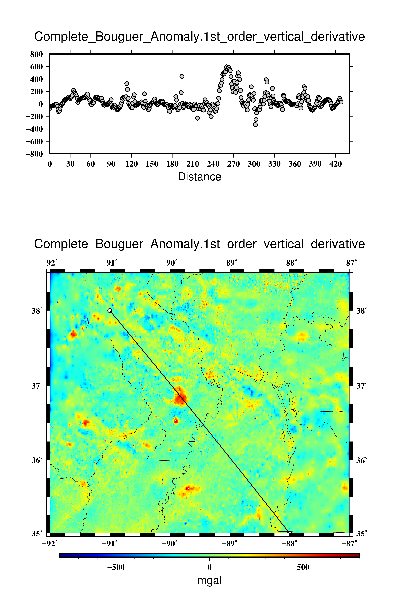

# The tutorial to use plot_cen_maggrav
- Bouguer gravity anomaly
- Reduce to pole magnetic anomaly
- total/dtrend magnetic field
- upward/downward continuation, 1st order vertical derivative, 2nd order vertical derivative, directional derivative
- all above processes could be use in gravity and magnetic field


# Simple commands to extract all you need
```
-   ./plot_cen_maggrav -92 -87 35 38.5 1 complete_bouguer 1 ( complete bouguer anamaly)
```

```
-   ./plot_cen_maggrav -92 -87 35 38.5 1 complete_bouguer_up_continuation 2 (2km upward continuation)
```

```
-   ./plot_cen_maggrav -92 -87 35 38.5 1 complete_bouguer_1st_order_vertical_derivative 3 (gravity 1st order vertical derivative) 
```

```
-   ./plot_cen_maggrav -92 -87 35 38.5 1 complete_bouguer_2nd_order_vertical_derivative 4 (gravity 2nd order vertical derivative)
```

```
-   ./plot_cen_maggrav -92 -87 35 38.5 1 complete_bouguer_directional_derivative 5 ( gravity 90 degree clockwise from north directional derivative)
```

```
-   ./plot_cen_maggrav -92 -87 35 38.5 2 RTP 1 ( reduce to pole magnetic anomaly)
```

```
-   ./plot_cen_maggrav -92 -87 35 38.5 3 magnetic 1 (magnetic field)
```

```
-   ./plot_cen_maggrav -92 -87 35 38.5 3 magnetic_up_continuation 2 (magnetic 2km upward continuation) 
```

```
-   ./plot_cen_maggrav -92 -87 35 38.5 3 magnetic_1st_order_vertical_derivative 3 ( magnetic 1st order vertical derivative)
```

```
-   ./plot_cen_maggrav -92 -87 35 38.5 3 magnetic_2nd_order_vertical_derivative 4 ( magnetic 2nd order vertical derivative)
```

```
-   ./plot_cen_maggrav -92 -87 35 38.5 3 magnetic_directional_derivative 5 ( magnetic 90 degree directional derivative) 
```

# Directional derivative variation with azimuth (video clip)

[](https://drive.google.com/file/d/1gqYfQjx6byjadlzNMgdxRJFd5_lfwn-F/view?usp=sharing)
